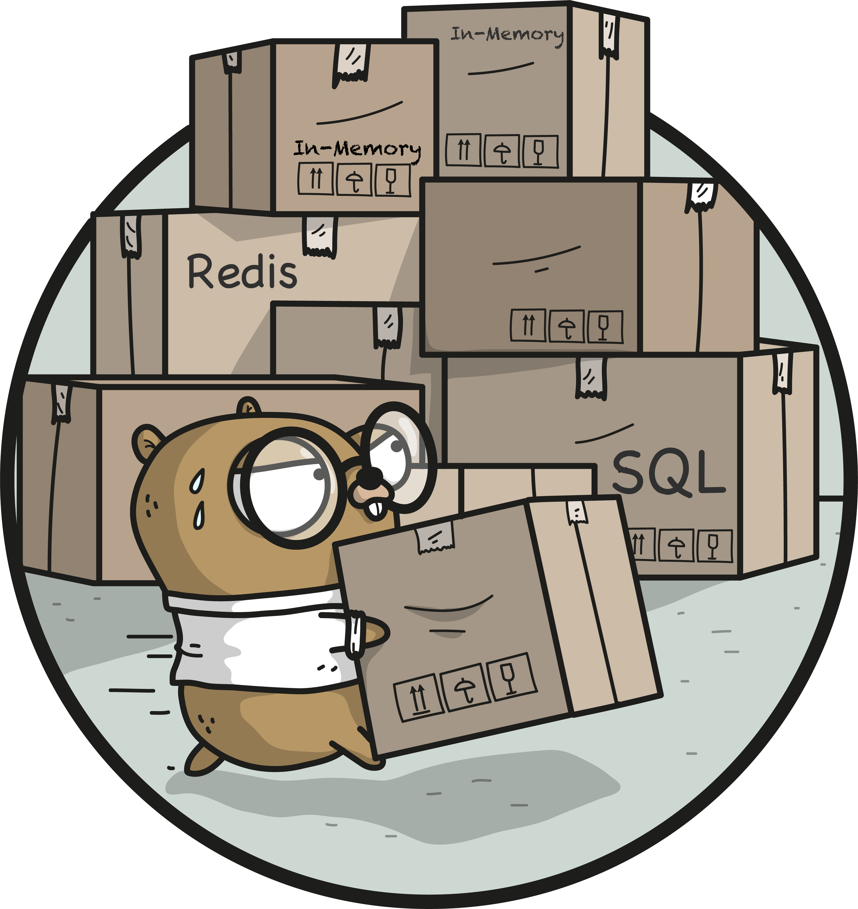
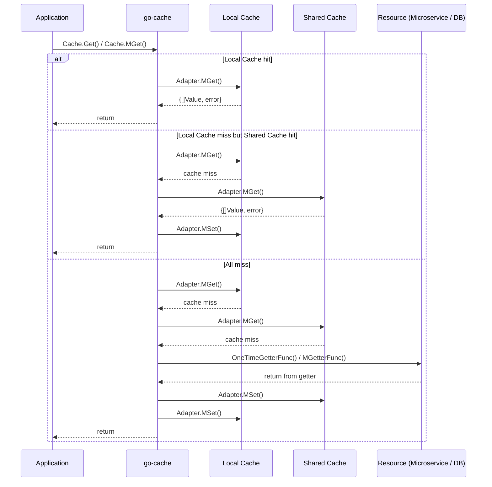
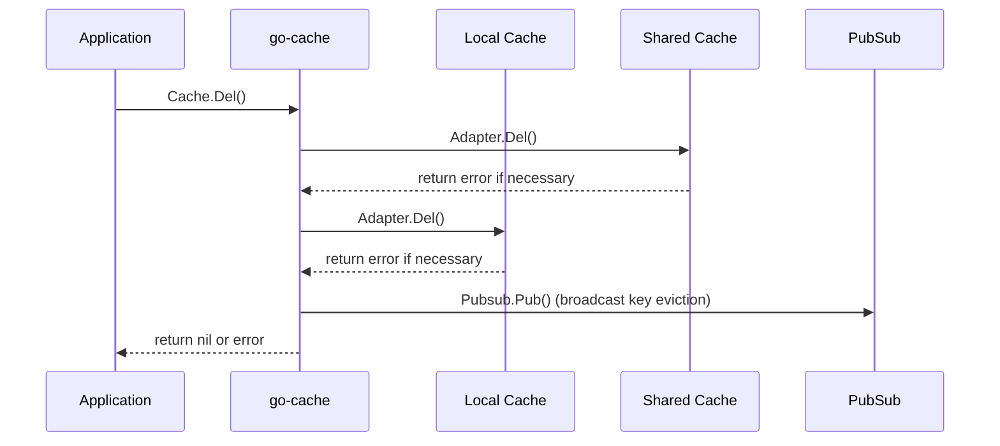

# go-cache

[](https://pkg.go.dev/github.com/viney-shih/go-cache?tab=doc)
[](https://app.travis-ci.com/viney-shih/go-cache)
[](https://goreportcard.com/report/github.com/viney-shih/go-cache)
[](https://codecov.io/gh/viney-shih/go-cache)
[](https://coveralls.io/github/viney-shih/go-cache?branch=master)
[](https://codeclimate.com/github/viney-shih/go-cache/maintainability)
[](https://sourcegraph.com/github.com/viney-shih/go-cache?badge)
[](http://www.apache.org/licenses/LICENSE-2.0)
[](https://app.fossa.com/projects/git%2Bgithub.com%2Fviney-shih%2Fgo-cache?ref=badge_shield)
[](https://github.com/avelino/awesome-go#caches)

<p align="center">
  
  <span style="font-size: 14px; font-weight: 400; color: rgba(117, 117, 117, 1); font-family: sohne, "Helvetica Neue", Helvetica, Arial, sans-serif;">Photo by <a href="https://github.com/ashleymcnamara">Ashley McNamara</a>, via <a href="https://github.com/ashleymcnamara/gophers">ashleymcnamara/gophers</a> (CC BY-NC-SA 4.0)</span>
</p>

A flexible multi-layered caching library interacts with **private (in-memory) cache** and **shared cache** (i.e. Redis) in Go. It provides `Cache-Aside` strategy when dealing with both, and maintains the consistency of private cache between distributed systems by `Pub-Sub` pattern.

Caching is a common technique that aims to improve the performance and scalability of a system. It does this by temporarily copying frequently accessed data to fast storage close to the application. Distributed applications typically implement either or both of the following strategies when caching data:
- Using a **private cache**, where data is held locally on the computer that's running an instance of an application or service.
- Using a **shared cache**, serving as a common source that can be accessed by multiple processes and machines.


Ref: [https://docs.microsoft.com/en-us/azure/architecture/best-practices/images/caching/caching3.png](https://docs.microsoft.com/en-us/azure/architecture/best-practices/images/caching/caching3.png "Using a local private cache with a shared cache")

Considering the flexibility, efficiency and consistency, we starts to build up our own framework.

## Features
- **Easy to use** : provide a friendly interface to deal with both caching mechnaism by simple configuration. Limit the size of memory on single instance (pod) as well.
- **Maintain consistency** : evict keys between distributed systems by `Pub-Sub` pattern.  
- **Data compression** : provide customized marshal and unmarshal functions.
- **Fix concurrency issue** : prevent data racing happened on single instance (pod).
- **Metric** : provide callback functions to measure the performance. (i.e. hit rate, private cache usage, ...)

## Data flow
### Load the cache with `Cache-Aside` strategy


### Evict the cache


## Installation
```sh
go get github.com/viney-shih/go-cache
```

## Get Started
### Basic usage: Set-And-Get

By adopting `Singleton` pattern, initialize the *Factory* in main.go at the beginning, and deliver it to each package or business logic.

```go
// Initialize the Factory in main.go
tinyLfu := cache.NewTinyLFU(10000)
rds := cache.NewRedis(redis.NewRing(&redis.RingOptions{
    Addrs: map[string]string{
        "server1": ":6379",
    },
}))

cacheFactory := cache.NewFactory(rds, tinyLfu)
```

Treat it as a common **key:value** store like Redis. But more advanced, it coordinated the usage between multi-layered caching mechanism inside.

```go
type Object struct {
    Str string
    Num int
}

func Example_setAndGetPattern() {
    // We create a group of cache named "set-and-get".
    // It uses the shared cache only. Each key will be expired within ten seconds.
    c := cacheFactory.NewCache([]cache.Setting{
        {
            Prefix: "set-and-get",
            CacheAttributes: map[cache.Type]cache.Attribute{
                cache.SharedCacheType: {TTL: 10 * time.Second},
            },
        },
    })

    ctx := context.TODO()

    // set the cache
    obj := &Object{
        Str: "value1",
        Num: 1,
    }
    if err := c.Set(ctx, "set-and-get", "key", obj); err != nil {
        panic("not expected")
    }

    // read the cache
    container := &Object{}
    if err := c.Get(ctx, "set-and-get", "key", container); err != nil {
        panic("not expected")
    }
    fmt.Println(container) // Output: Object{ Str: "value1", Num: 1}

    // read the cache but failed
    if err := c.Get(ctx, "set-and-get", "no-such-key", container); err != nil {
        fmt.Println(err) //  Output: errors.New("cache key is missing")
    }

    // Output:
    // &{value1 1}
    // cache key is missing
}

```

### Advanced usage: `Cache-Aside` strategy

`GetByFunc()` is the easier way to deal with the cache by implementing the **getter function** in the parameter. When the cache is missing, it is going to refill the cache automatically.

```go
func ExampleCache_GetByFunc() {
    // We create a group of cache named "get-by-func".
    // It uses the local cache only with TTL of ten minutes.
    c := cacheFactory.NewCache([]cache.Setting{
        {
            Prefix: "get-by-func",
            CacheAttributes: map[cache.Type]cache.Attribute{
                cache.LocalCacheType: {TTL: 10 * time.Minute},
            },
            MarshalFunc:   msgpack.Marshal, // msgpack is from "github.com/vmihailenco/msgpack/v5"
            UnmarshalFunc: msgpack.Unmarshal,
        },
    })

    ctx := context.TODO()
    container2 := &Object{}
    if err := c.GetByFunc(ctx, "get-by-func", "key2", container2, func() (interface{}, error) {
        // The getter is used to generate data when cache missed, and refill the cache automatically..
        // You can read from DB or other microservices.
        // Assume we read from MySQL according to the key "key2" and get the value of Object{Str: "value2", Num: 2}
        return Object{Str: "value2", Num: 2}, nil
    }); err != nil {
        panic("not expected")
    }

    fmt.Println(container2) // Object{ Str: "value2", Num: 2}

    // Output:
    // &{value2 2}
}
```

`MGetter` is another approaching way to do this. Set this function durning registering the *Setting*.

```go
func ExampleService_Create_mGetter() {
    // We create a group of cache named "mgetter".
    // It uses both shared and local caches with separated TTL of one hour and ten minutes.
    c := cacheFactory.NewCache([]cache.Setting{
        {
            Prefix: "mgetter",
            CacheAttributes: map[cache.Type]cache.Attribute{
                cache.SharedCacheType: {TTL: time.Hour},
                cache.LocalCacheType:  {TTL: 10 * time.Minute},
            },
            MGetter: func(keys ...string) (interface{}, error) {
                // The MGetter is used to generate data when cache missed, and refill the cache automatically..
                // You can read from DB or other microservices.
                // Assume we read from MySQL according to the key "key3" and get the value of Object{Str: "value3", Num: 3}
                // HINT: remember to return as a slice, and the item order needs to consist with the keys in the parameters.
                return []Object{{Str: "value3", Num: 3}}, nil
            },
            MarshalFunc:   cache.Marshal,
            UnmarshalFunc: cache.Unmarshal,
        },
    })

    ctx := context.TODO()
    container3 := &Object{}
    if err := c.Get(ctx, "mgetter", "key3", container3); err != nil {
        panic("not expected")
    }

    fmt.Println(container3) // Object{ Str: "value3", Num: 3}

    // Output:
    // &{value3 3}
}
```

[More examples](./example_advanced_test.go)

## References
- https://docs.microsoft.com/en-us/azure/architecture/best-practices/caching
- https://github.com/vmihailenco/go-cache-benchmark
- https://github.com/go-redis/cache

## License
[Apache-2.0](https://opensource.org/licenses/Apache-2.0)


[](https://app.fossa.com/projects/git%2Bgithub.com%2Fviney-shih%2Fgo-cache?ref=badge_large)